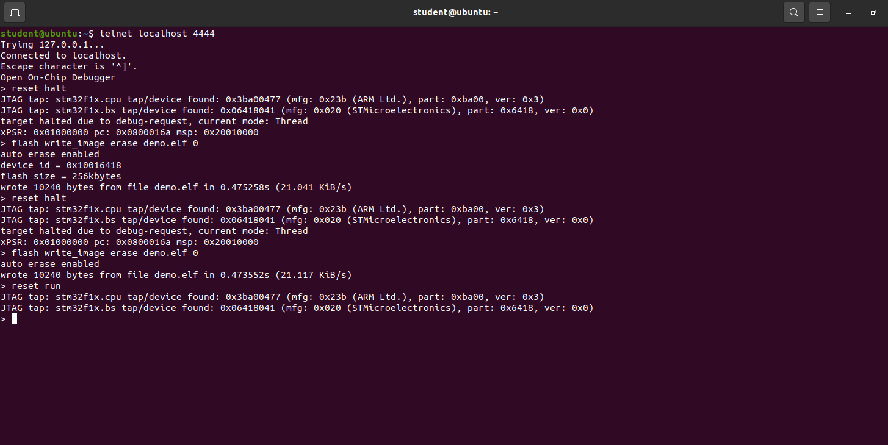
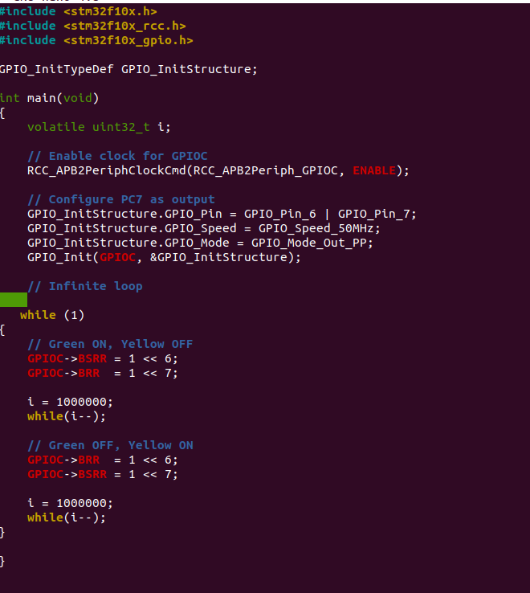
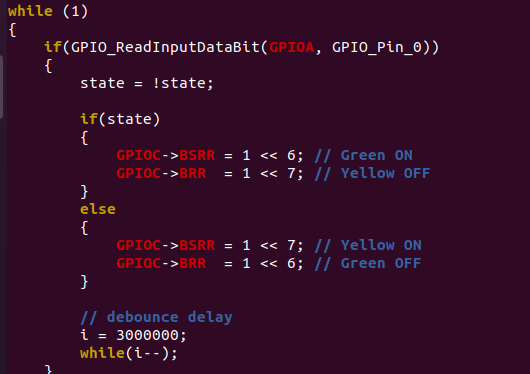
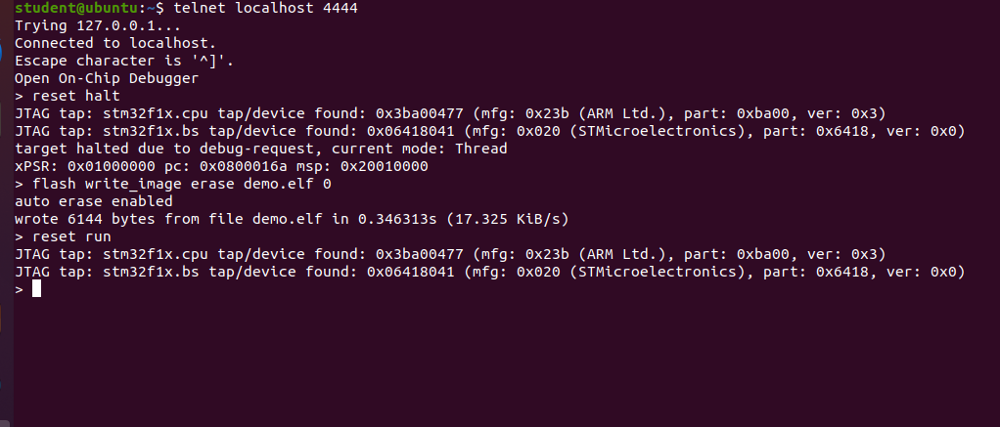
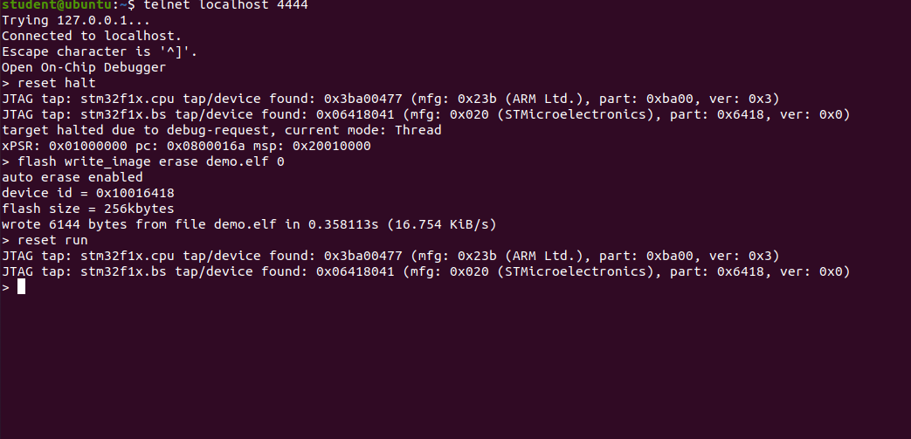

# SES Worksheet 3

## Overview
This project implements LED control and button handling on the STM32F10x board, including debouncing using both delay and FSM methods.

---

## Pass 1 – Basic LED Blink
A simple LED blinking program using delay loops.

---

## Pass 2 – Direct Register Access
LED control implemented using direct register manipulation instead of library functions.

.png)

---

## Pass Exercise 1 – Button Toggle (Single LED)
Each button press toggles a single LED ON/OFF.

---

## Pass Exercise 2 – Alternate LEDs
Button press alternates between green and yellow LEDs.

---

## Basic Debounce (Delay Method)
A delay loop is used after button press to avoid multiple triggers.

---

## Credit Exercise – FSM Debounce
A finite state machine ensures stable input handling.

---

## Flash Process
Program successfully uploaded to STM32 using OpenOCD.

---

## Videos

1. Pass 1 – Basic LED Blink  
[Watch](https://drive.google.com/file/d/1T7gEeuOF-6-TnAlmNUUm9xKCakeCnFss/view?usp=drivesdk)

2. Pass 2 – Direct Register Access  
[Watch](https://drive.google.com/file/d/1auLSutAqoOCNqwprRWD6V8aywVH2zkfZ/view?usp=drivesdk)

3. Pass Exercise 1 – Button Toggle  
[Watch](https://drive.google.com/file/d/1H5pxuCSjxKUQlgCOAY4PgJtrjw8tZLgd/view?usp=drivesdk)

4. Pass Exercise 2 – Alternate LEDs  
[Watch](https://drive.google.com/file/d/1I5yfuOX9Urnfz3JQ8MaVqi8tlr_ZNIeT/view?usp=drivesdk)

5. Basic Debounce  
[Watch](https://drive.google.com/file/d/11xqZ7WRE4QGIHCQ2MmYgE-EnaEccYzBj/view?usp=drivesdk)

6. FSM Debounce (Credit)  
[Watch](https://drive.google.com/file/d/1xaE9ZDdasBWlvRMlttQAew6dKQtcL-nq/view?usp=drivesdk)

---

## Conclusion
All pass and credit exercises were successfully completed. FSM debounce provided a more reliable and professional solution compared to delay-based debouncing.
